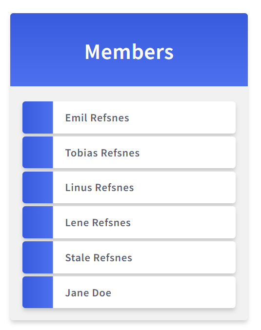

# Resumen sesión 17.01

- Rehacemos el env -> no funcionaba el anterior
- `py -m venv miapp`
- activas entorno
- Instalamos Django y whitenoise:^
```
pip install Django
```
``` 
pip install whitenoise
```
- Creamos `requirements.txt`:^
```
pip freeze > requirements.txt
```
Sale algo asi:
```
asgiref==3.6.0
Django==4.1.5
sqlparse==0.4.3
tzdata==2022.7
whitenoise==6.3.0
```
- Para instalar los modulos en otro ordenador:^
```
pip install -r requirements.txt
```

## Estilos

-> La carpeta se llama **static** por defecto

- Para añadir estilos hemos creado `main.css`:
```
py manage.py collectstatic
```

Si no sale favicon.ico, probar con cntl + f5

## Lista de preguntas

- Preguntas


